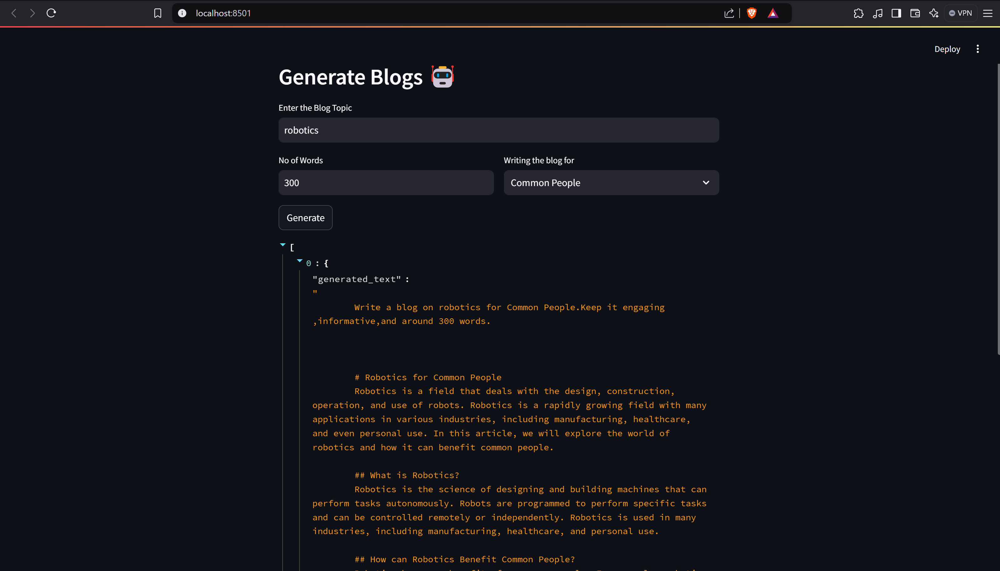

# Blog-Generation-App

This is a **Blog Generation Application** built using the LLaMA 3.2 model and Streamlit. The app allows users to generate engaging, informative blogs by providing a topic, desired word count, and target audience style.

## Features

- **LLama 3.2 Integration:** Uses the powerful LLaMA 3.2 model for generating high-quality content.
- **Customizable Prompts:** Users can specify the blog topic, word count, and writing style (e.g., Researchers, Data Scientists, Common People).
- **Streamlit Interface:** A simple and interactive UI for seamless blog generation.

## Usage

1. Run the Streamlit app:
    ```bash
    streamlit run app.py
    ```

2. Fill in the following fields:
    - **Blog Topic:** Enter the main topic for your blog.
    - **Word Count:** Specify the number of words (e.g., 300).
    - **Writing Style:** Choose the target audience for your blog (e.g., Researchers, Data Scientists, Common People).

3. Click **Generate** to create the blog. The generated text will appear below the form.

## Code Overview

### Key Components:

1. **LLaMA 3.2 Model Integration:**
    - The model and tokenizer are loaded using Hugging Face's Transformers library.
    - The `text-generation` pipeline is utilized for efficient blog generation.

2. **Streamlit Interface:**
    - Collects user input for topic, word count, and style.
    - Displays the generated blog directly in the app.


